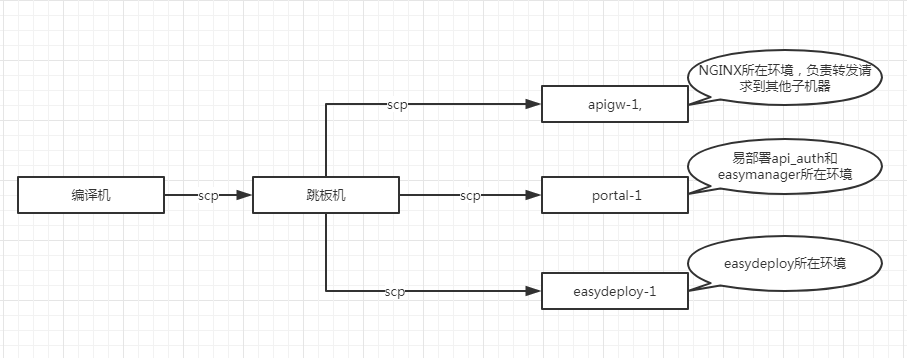
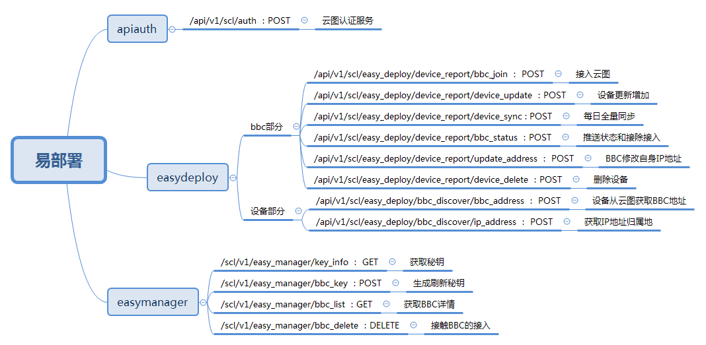

## 云图开发环境概览

+ 编译机
	+ 编译机地址：root/scloud  10.118.194.1 
	+ 编译机编译规则：
		+ 进入到想要编译的工程目录下,例：cd X-Central/source/src/apps/easydeploy/src/daemon/easydeploy/
		+ 输入 source /root/helin/X-Central/source/build/devenvrc
		+ 输入 make 完成编译
+ 跳板机（堡垒机）
	+ 跳板机地址：root/xcentral@SF  10.118.16.105
	+ 查看各服务部署的机器：cat /etc/hosts
	+ 易部署相关的后台机器：apigw-1 , portal-1 , easydeploy-1
		+ apigw-1：NGINX所在环境，负责转发请求到具体的服务
		+ portal-1：易部署api_auth和easymanage所在环境
		+ easydeploy-1：easydeploy所在环境
+ 文件传输(scp)和服务切换
	+ 编译机编译完exe -> 跳板机 -> 具体的服务机器	 
	+ 目前云图采用supervisor管理服务，因此更换服务先把旧的exe替换掉，然后干掉旧服务，之后supervisor自动会再拉起这个服务
	+ 命令顺序（以easydeploy为例）：
		+ rm /sf/scloud/bin/easydeploy
		+ cp easydeploy /sf/scloud/bin/
		+ ps aux | grep easydeploy
		+ kill 上面找到的pid
+ 云图工作环境介绍(/sf 目录，类似Linux目录结构）：
	+ /sf/scloud/bin：可执行文件存放目录
	+ /sf/scloud/etc：配置文件存放地
		+ ./easydeploy：存放微服务自己的配置文件
		+ ./service_cfg：存放整个工程共享的配置文件，这里面env.conf会被各个子微服务的配置文件所引用，env.conf存放一些mysql redis配置
	+ /sf/scloud/var/log：这台机器上部署的各个服务的日志目录
	
## 云端易部署项目接口概览

